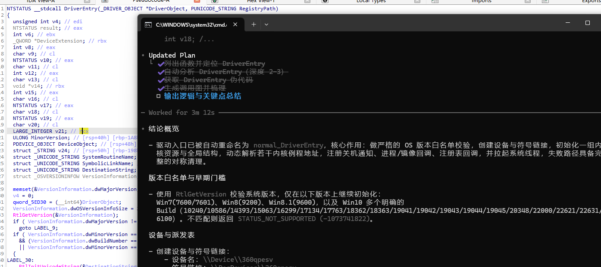

# ida-codex-mcp

Local MCP (Model Context Protocol) server plus an IDA 9.2 plugin to expose common reverse engineering capabilities to MCP clients.

- `ida_bridge.py`: an IDA plugin that exposes core analysis features (function list, call graph, Hex-Rays pseudocode, disassembly, imports/exports, xrefs, strings, memory reads, etc.) over a local TCP JSON interface (default `127.0.0.1:31337`).
- `mcp_ida_server.py`: a local MCP server that talks to the IDA plugin, then re-exposes features as MCP tools and resources over STDIN/STDOUT so MCP clients (e.g., Codex CLI) can use them directly.


## Features

- Functions and calls
  - List functions: `ida_list_functions`
  - Call graph: `ida_call_graph(name, max_depth)`
  - Analyze and optionally rename: `ida_analyze_function(name, max_depth, rename, rename_locals)`
- Decompile/Disassemble
  - Pseudocode (Hex-Rays): `ida_get_pseudocode(name|ea, offset, limit)`
  - Disassembly: `ida_get_disassembly(name|ea, offset, limit)`
  - Rename function: `ida_rename_function(old_name, new_name)`
- Program info
  - Imports: `ida_get_imports`
  - Exports: `ida_get_exports`
  - Cross-references: `ida_get_xrefs(target)` (name or address)
  - Globals: `ida_list_globals(offset, count)`
  - Memory read: `ida_read_memory(address, size)`
  - Strings: `ida_get_strings(min_length, offset, count)`
- Multi-target routing (NEW)
  - Actively discover running IDA instances: `ida_discover_targets`
  - List known targets (configured + discovered): `ida_list_targets`
  - Set active target for subsequent calls: `ida_set_active_target`
  - Find an API across all targets: `ida_find_function_across_targets`
  - All `ida_*` tools support optional `ida_target` argument
  - Route one MCP server to multiple IDA instances (for example `A.dll` and `B.dll`)
- **Function Pointer Operations (NEW - FIXED v0.2.1)**
  - Jump to address: `ida_jump_to_address(address)`
  - Set data type: `ida_set_data_type(address, data_type)` (byte, word, dword, qword, etc.)
  - Set function pointer type: `ida_set_function_pointer_type(address, function_signature)`
  - Set name: `ida_set_name(address, name)`
  - **Complete workflow**: `ida_create_function_pointer(address, name, function_signature)` - converts `MEMORY[address]` calls to named function calls in Hex-Rays
  - **Recent fixes**: Resolved syntax errors in function signature parsing, added signature normalization, improved fallback types
- MCP resources
  - `resources/list`: export top functions as resources (first 500)
  - `resources/read`: fetch pseudocode (or fallback to disassembly) via `ida://function/{ea}/{name}`
  - `resources/templates/list`: provide `ida_function` template


## Repository Layout

```
ida-codex-mcp/
├─ ida_bridge.py        # IDA plugin: local TCP JSON bridge
├─ mcp_ida_server.py    # MCP local process server: bridge MCP <-> IDA
└─ __pycache__/         # cache generated at runtime
```


## Requirements

- IDA Pro 9.2 (Hex-Rays recommended for pseudocode features)
- Python 3.9+
- Windows/Linux/macOS


## Installation & Startup

1) IDA side (plugin)

- Copy `ida_bridge.py` into IDA's `plugins` directory and restart IDA.
- When a target is open, the plugin spawns a local listener at `127.0.0.1:31337` (auto-increments port if taken).

2) MCP side (local process)

- From this repo folder, run:

```bash
python mcp_ida_server.py
```

- To override the IDA bridge address/port (single target), set environment variables:

```bash
# Default: 127.0.0.1:31337
set IDA_HOST=127.0.0.1
set IDA_PORT=31337
```

- To connect multiple IDA instances from one MCP server, use:

```bash
# alias=host:port;alias=host:port
set IDA_TARGETS=A=127.0.0.1:31337;B=127.0.0.1:31338
# optional, default is "default"
set IDA_DEFAULT_TARGET=A
```

- Then call tools with `ida_target`:

```json
{"jsonrpc":"2.0","id":"10","method":"tools/call","params":{"name":"ida_list_functions","arguments":{"ida_target":"A"}}}
{"jsonrpc":"2.0","id":"11","method":"tools/call","params":{"name":"ida_list_functions","arguments":{"ida_target":"B"}}}
```

- Optional auto-discovery range overrides:

```bash
set IDA_DISCOVERY_HOST=127.0.0.1
set IDA_DISCOVERY_PORT_START=31337
set IDA_DISCOVERY_PORT_END=31437
set IDA_AUTO_DISCOVER_ON_START=1
# If MCP process may restart frequently, skip repeated startup scan in this interval (seconds)
set IDA_STARTUP_DISCOVERY_MIN_INTERVAL_SEC=30
# Hard budget for startup discovery (seconds). Discovery stops early when budget is reached.
set IDA_STARTUP_DISCOVERY_TIMEOUT_SEC=4.0
# Fast TCP connect timeout used for per-port probe (milliseconds, localhost can be very small)
set IDA_DISCOVERY_CONNECT_TIMEOUT_MS=15
# Retry timeout for busy IDA UI thread (milliseconds)
set IDA_DISCOVERY_RETRY_TIMEOUT_MS=1200
# Optional cache file for discovered targets (restored on next start)
set IDA_DISCOVERY_CACHE_FILE=C:\temp\ida_mcp_targets_cache.json
```

- Discovery + locate workflow:

```json
{"jsonrpc":"2.0","id":"20","method":"tools/call","params":{"name":"ida_discover_targets","arguments":{}}}
{"jsonrpc":"2.0","id":"21","method":"tools/call","params":{"name":"ida_find_function_across_targets","arguments":{"name":"CreateFileW","match_mode":"exact"}}}
{"jsonrpc":"2.0","id":"22","method":"tools/call","params":{"name":"ida_set_active_target","arguments":{"ida_target":"B"}}}
```

- The process communicates over STDIN/STDOUT. Register it in your MCP client (e.g., Codex CLI) to use tools and resources.

## Codex CLI Integration (config.toml)

Add this server to Codex CLI's `config.toml` so the tools appear in the client. The exact location of the config file depends on your setup, for example:

- Windows: `%AppData%\\Codex\\config.toml`
- macOS: `~/Library/Application Support/Codex/config.toml`
- Linux: `~/.config/codex/config.toml`

Example configuration using stdio transport:

```toml
# Register an MCP server named "ida"
[mcp.servers.ida]
type = "stdio"
command = "python"
# Use an absolute path to the server script; single quotes are safe for Windows paths
args = ['D:\\Code\\ida-codex-mcp\\mcp_ida_server.py']

# Optional environment overrides:
# - Single target: IDA_HOST + IDA_PORT
# - Multi target: IDA_TARGETS + IDA_DEFAULT_TARGET
env = { IDA_TARGETS = "A=127.0.0.1:31337;B=127.0.0.1:31338", IDA_DEFAULT_TARGET = "A" }

# Optional stability knobs
enabled = true
restart_on_exit = true
timeout_ms = 15000
```

Unix-like path variant:

```toml
[mcp.servers.ida]
type = "stdio"
command = "python3"
args = ["/path/to/ida-codex-mcp/mcp_ida_server.py"]
env = { IDA_HOST = "127.0.0.1", IDA_PORT = "31337" }
# or:
# env = { IDA_TARGETS = "A=127.0.0.1:31337;B=127.0.0.1:31338", IDA_DEFAULT_TARGET = "A" }
enabled = true
restart_on_exit = true
timeout_ms = 15000
```

Verification steps:

- Ensure IDA is running with `ida_bridge.py` loaded and a database open.
- Restart Codex CLI so it picks up the new server.
- In Codex CLI, list tools and confirm `ida_*` tools (e.g., `ida_list_functions`, `ida_get_pseudocode`) are available.


## Quick Check (two ways)

Option A: Direct TCP to the IDA plugin (simple self-test)

```python
# quick_test.py
import json, socket

HOST, PORT = "127.0.0.1", 31337
req = {"method": "list_functions", "params": {}}

s = socket.create_connection((HOST, PORT), timeout=5)
s.sendall((json.dumps(req) + "\n").encode("utf-8"))
data = s.recv(65536)
print("IDA reply:", data.decode("utf-8", "ignore"))
```

```bash
python quick_test.py
```

Option B: Through MCP (recommended via an MCP client)

- Initialize:

```json
{"jsonrpc":"2.0","id":"1","method":"initialize","params":{"protocolVersion":"2024-11-05"}}
```

- List tools:

```json
{"jsonrpc":"2.0","id":"2","method":"tools/list"}
```

- Call example (list functions):

```json
{"jsonrpc":"2.0","id":"3","method":"tools/call","params":{"name":"ida_list_functions","arguments":{}}}
```

Tip: Sending single JSON lines via a pipe is only for smoke tests—register this process in an MCP client for the best experience.


## Function Pointer Workflow Example

The new function pointer tools help convert Hex-Rays pseudocode from this:

```c
v10 = MEMORY[0xFFFFF803799C3010](a1, a4, 48, 1, 538997579);
```

To this:

```c
v10 = SomeApiCall(a1, a4, 48, 1, 538997579);
```

**Method 1: Manual steps**
1. `ida_jump_to_address(address=0xFFFFF803799C3010)` - Jump to the address
2. `ida_set_data_type(address=0xFFFFF803799C3010, data_type="qword")` - Set as 8-byte pointer
3. `ida_set_function_pointer_type(address=0xFFFFF803799C3010, function_signature="NTSTATUS (__fastcall *)(void *, void *, int, int, int)")` - Set function pointer type
4. `ida_set_name(address=0xFFFFF803799C3010, name="SomeApiCall")` - Give it a name

**Method 2: One-step workflow**
```
ida_create_function_pointer(
  address=0xFFFFF803799C3010,
  name="SomeApiCall", 
  function_signature="NTSTATUS (__fastcall *)(void *, void *, int, int, int)"
)
```

This performs all steps automatically and refreshes the Hex-Rays view.

## FAQ

- If Hex-Rays is not installed, `ida_get_pseudocode` will error; use `ida_get_disassembly` instead.
- To add pseudocode comments, use `ida_py_exec` to call IDA's Python API (e.g., `ida_hexrays` / `idc.set_cmt`) directly.
- Function pointer operations require the address to be mapped in IDA's address space.
- Function signatures should follow standard C function pointer syntax: `return_type (__calling_convention *)(param_types)`
- If port `31337` is occupied, the plugin increases the port number automatically; set `IDA_PORT` accordingly on the MCP side to match.
- Transport encoding is UTF-8; each request/response is a single JSON line ending with a newline.


## License

TBD. Contributions welcome—please mention license intentions in PRs.


## Demo


